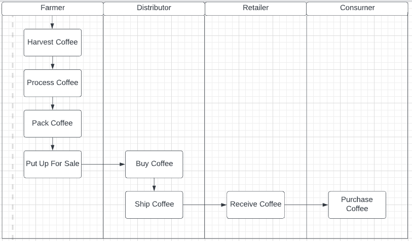
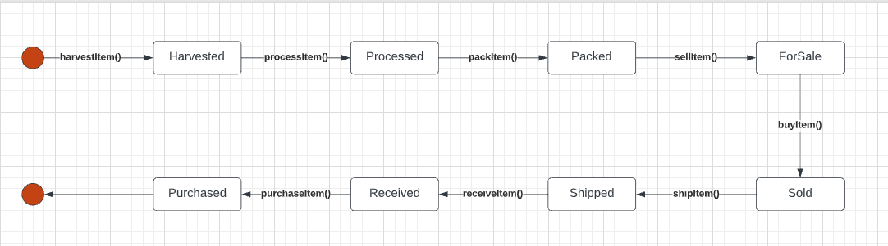
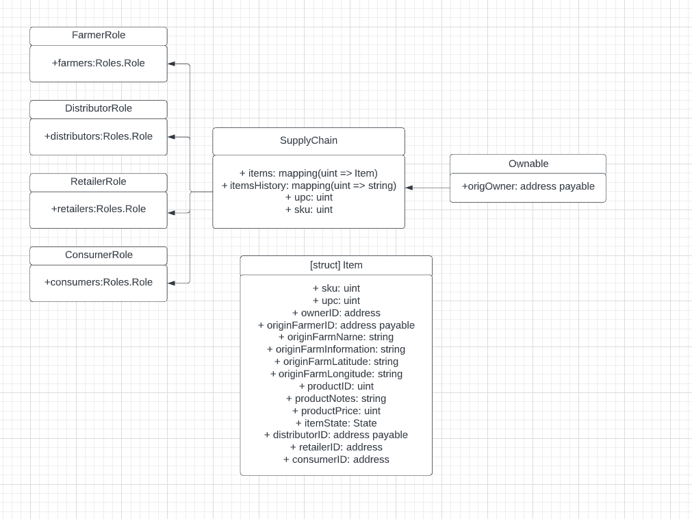

# Udacity Coffee Supply Chain Project

This is the Coffee Supply Chain project from Udacity's Blockchain Nanodegree course.

## Getting Started

1) Install the required npm packages:

```
cd project-6
npm install
```

2) Start Ganache:

```
./1_start_ganache-cli.sh
```

3) Compile and run tests:

```
cd project-6
truffle compile && truffle test
```

## Sequence Diagram


## Activity Diagram



## State Diagram



## Data Model



## Libraries
The project uses Ownable library to manage contract access and ownership.
Roles library (Farmer, Distributor, Retailer, Consumer) is used to manage roles and access control.

## Contract Address on Rinkeby Network

0x1833839a664Fab89cB4C90041Dd93231d178b37e

## Getting Started
